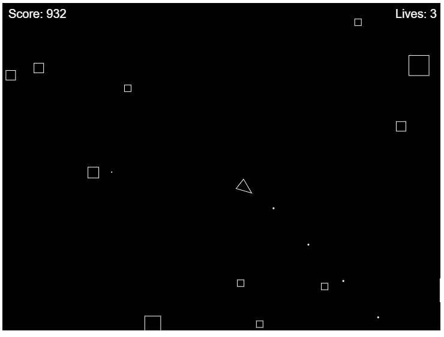

# Learn to Program with JavaScript

This workshop is targeted at those who have little to no programming experience.
During this workshop, we will develop an Astroids game using JavaScript and the
p5.js library. Anuradha will guide students through the process of creating the
game from start to finish. Students will have the opportunity to provide input
which guides the development as she goes.

All of the code developed during the class session will be available in a GitHub
repository which will be posted shortly after the conclusion of the session.
Students are encouraged to check out the code and play with it themselves,
extending it, adding new features, or maybe even fixing some bugs.

# Starter Kit

This repository contains a directory called [starter_kit](starter_kit). In order to reduce some
of the setup work for the workshop, students are encouraged to download or clone
this repository and then open the starter_kit directory in their editor in order
to follow along with the instruction. It provides the basic shell of the game and
the functionality will be filled in during the session.

# Handbook

The [Wiki](https://github.com/NetApp-YWIT/ywit_2020_js_workshop/wiki) pages of this
repository provide a handbook briefly explaining most of the concepts and functions
that are used as part of this workshop. In it you will find descriptions and pictures
of how each of the functions used to create the asteroids game works. This handbook
is meant to accompany the live workshop session, but won't necessarily replace it.
