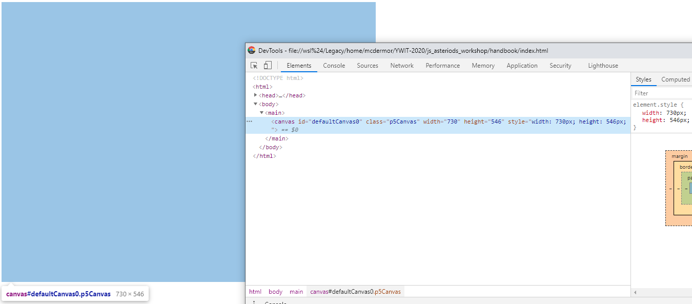

# Creating a Canvas

The first thing you'll want to do when starting a new p5.js application is to
create a canvas to draw on. A canvas in the HTML world is is an element which
can be used to display graphics drawn by JavaScript programs. You can see more
information [here](https://developer.mozilla.org/en-US/docs/Web/API/Canvas_API/Tutorial)

In our program, we want to create the canvas once so we're going to modify the
`setup()` function and add a call to the p5.js function called `createCanvas()`:

```JavaScript
function setup() {
    // code run once at the beginning of the game
    createCanvas(730, 546);
}

function draw() {
    // code run on each frame of the game
}
```

If we were to refresh our browser window now, we'd still see almost nothing.
However, the new thing we've created is invisible. If we opened the developer
tools, we'd be able to see that there has indeed been a new `<canvas>` element
created in our document and that it has the same size as what we specified in
our script:



In the next section, we'll find out how to start making changes to the canvas on
each loop of our program.
