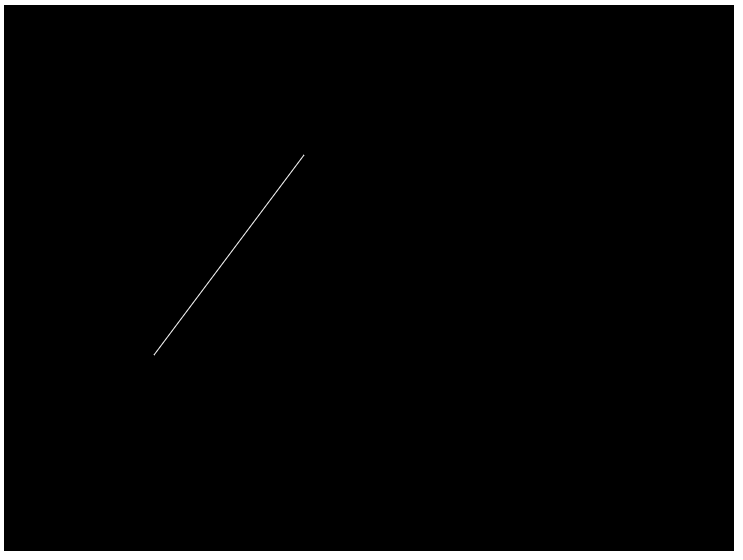
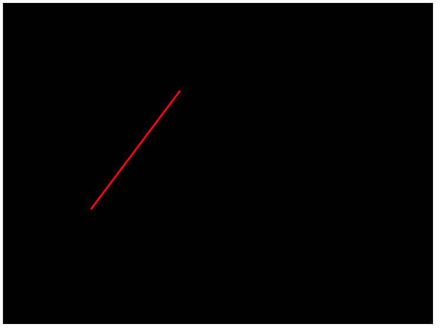
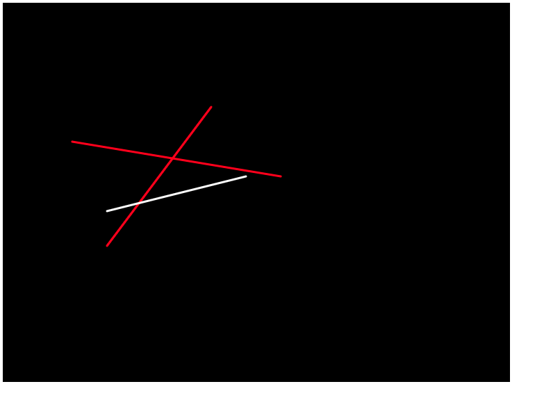
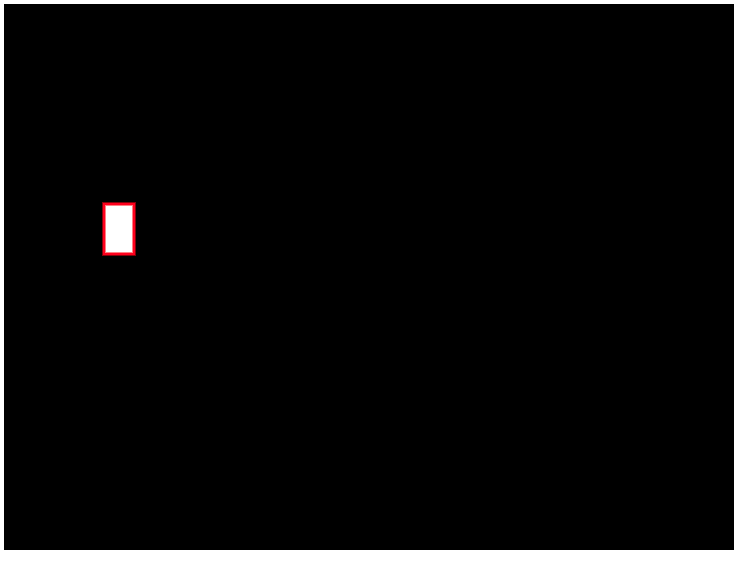
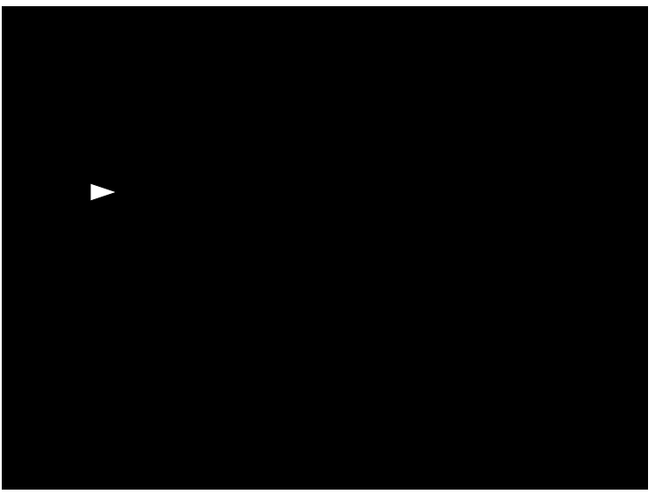
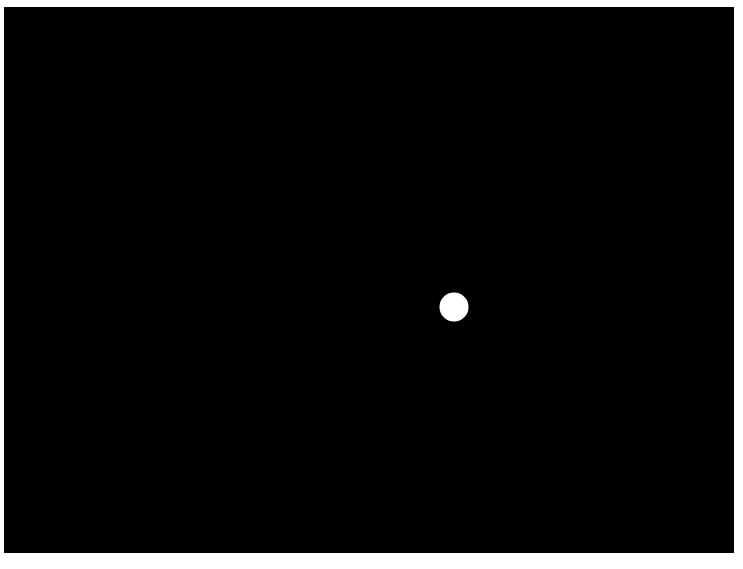

# Lines and Shapes

Now that we've drawn a basic backdrop for our application, let's talk about how
we can start designing on top of that. p5.js provides functions for drawing many
basic shapes. We'll cover some of them below.

## Line

The most basic shape you can draw would be a line. Here's what it would look like
to specify one in our application:

```javascript
function setup() {
    // code run once at the beginning of the game
    createCanvas(730, 546);
}

function draw() {
    // code run on each frame of the game
    background(0, 0, 0);
    stroke(255, 255, 255);
    line(150, 350, 300, 150);
}
```

We've called two new p5.js functions here, `stroke()` and `line()`. The `stroke()`
function sets the color of any lines that follow it in the code. Here we've set
the color of the stroke to be white by setting the max value on each of the red,
green, and blue components (`255, 255, 255`). Then we've called the `line()` function.
This function takes 4 arguments representing the x and y coordinates of each point
at the ends of the line. If we refreshed our browser, this is what we see:



Our application is now drawing both the black background as well as the line that
we've defined each frame. Our line goes from the bottom left to the top right because
of the way we've defined our points and the way that p5.js defines its coordinate
system.

> Side note on coordinates. In p5.js, x=0 all the way on the lefthand side of the
  canvas. y=0 is all the way on the top of the canvas. The values for x increase
  as you move to the right. The values for y increase as you move toward the bottom.
  This is common in most computer coordinate systems, but not all. Just think of
  it as matching the way you would read a book (top down and left to right).

If we wanted to make our line a different color or different thickness, we could
do that too:

```javascript
function setup() {
    // code run once at the beginning of the game
    createCanvas(730, 546);
}

function draw() {
    // code run on each frame of the game
    background(0, 0, 0);
    stroke(255, 0, 0);
    strokeWeight(3);
    line(150, 350, 300, 150);
}
```



Now our line is red and a bit thicker. You can adjust how thick a line is by
setting `strokeWeight()` to a value representing the numbe of pixels thick you
want it to be.

## Push and Pop

We've seen that there are some functions which can affect what comes after them.
In our previous examples, these have been `stroke()` and `strokeWeight()`. Both
of these functions affect the drawing context and anything drawn after they are
called will have the same properties. For example, keeping our last code block and
adding to it, you can see that all of the lines we draw are the same thickness and
color:

```javascript
function setup() {
    // code run once at the beginning of the game
    createCanvas(730, 546);
}

function draw() {
    // code run on each frame of the game
    background(0, 0, 0);
    stroke(255, 0, 0);
    strokeWeight(3);
    line(150, 350, 300, 150);
    line(150, 300, 350, 250);
    line(100, 200, 400, 250);
}
```


But what if we didn't want them to all be the same color? One thing we could do
would be to call the `stroke()` function again between each call to the `line()`
function. However, this can get tricky as your application starts to get bigger
and you are drawing more things. Another way that you can save your settings is
by using the `push()` and `pop()` functions. The `push()` function saves all of
the current drawing settings in your context and then starts a new one. The `pop()`
reverses this.

Think of these functions helping you manage a collection of pens that you are
drawing with. You might select the pen you want to draw with and then choose a
new one for a different part of your drawing. You put the original one down (by
calling `push()`), pick up a new one (by calling `stroke()` or `strokeWeight()`),
start drawing with that one for a bit, and then pick the old one back up (by
calling `pop()`). Here's an example with our lines:

```javascript
function setup() {
    // code run once at the beginning of the game
    createCanvas(730, 546);
}

function draw() {
    // code run on each frame of the game
    background(0, 0, 0);
    stroke(255, 0, 0);
    strokeWeight(3);
    line(150, 350, 300, 150);
    push();
    stroke(255, 255, 255);
    line(150, 300, 350, 250);
    pop();
    line(100, 200, 400, 250);
}
```



In our code, we set up our first pen as red and drew a line. Then we called `push()`
to save that pen for later. We then set up our second pen to be a white color and
drew another line. Finally, we picked up the original pen by calling `pop()` and
drew our final line which was again the original red color.

Keep these functions in mind as you start drawing more things on your canvas. It
is good practice to call `push()` before you change any of your pen settings and
`pop()` afterward. By doing this, you won't have to worry about what order things
are drawn in on your canvas.

## Other Shapes

Now we've learned how to draw a line and you could make almost any shape out of
lines. But that could be tedious if you needed to draw 4 lines for every rectangle
that you wanted to draw. p5.js has some other builtin shapes ready to go for you.

### Rectangle

If you want to draw a rectangle, you need to specify 4 arguments. The first two
are the x and y location of the top left corner of the rectangle. The second two
are how wide and tall the rectangle are:

```javascript
function setup() {
    // code run once at the beginning of the game
    createCanvas(730, 546);
}

function draw() {
    // code run on each frame of the game
    background(0, 0, 0);
    stroke(255, 0, 0);
    strokeWeight(3);
    fill(255, 255, 255);
    rect(100, 200, 30, 50);
}
```



Here we've specified a rectangle that will be drawn with its upper left corner at
point x=100, y=200 and that it will be 30 pixels wide by 50 pixels tall. We also
introduced a new pen function called `fill()`. This allows shapes to be filled in
with a color which is different from their `stroke()` color (their border color).
Here we've made the middle of the rectangle white and drawn a thick red border
around the outside of it.

### Triangle

p5.js can also draw a triangle for us. When specifying a triangle, we need to
specify a pair of coordinates for each point on the triange:

```javascript
function setup() {
    // code run once at the beginning of the game
    createCanvas(730, 546);
}

function draw() {
    // code run on each frame of the game
    background(0, 0, 0);
    fill(255, 255, 255);
    triangle(100, 200, 130, 210, 100, 220);
}
```



Here we have 3 points specified and p5.js has constructed a triangle from that and
filled it in with a white color. You can also provide a stroke color if you wish.

### Circle

The last shape we'll talk about is a circle. To specify a cirle, you need to give
the x and y coordinates of the center of the circle and then a value for the diameter:

```javascript
function setup() {
    // code run once at the beginning of the game
    createCanvas(730, 546);
}

function draw() {
    // code run on each frame of the game
    background(0, 0, 0);
    fill(255, 255, 255);
    circle(450, 300, 30);
}
```



Again, you can provide a stroke color if you want.
