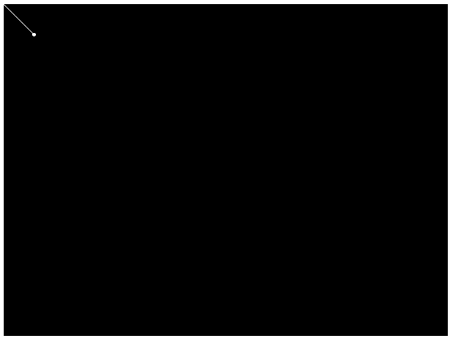
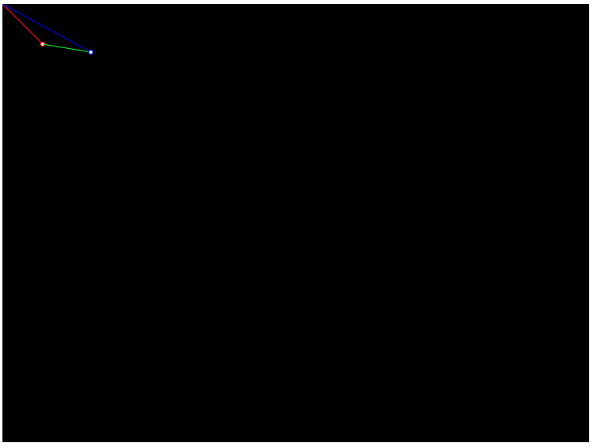

# Vectors

In many p5.js programs, especially those where objects move, you will see calls
to `createVector()`. This function is built in to p5.js to help describe and work
with Euclidean vectors. These are entities that represent a magnitude and direction.
You can think of them as arrows drawn on the canvas. Let's try that:

```javascript
var arrow;

function setup() {
    // code run once at the beginning of the game
    createCanvas(730, 546);
    arrow = createVector(50, 50);
}

function draw() {
    // code run on each frame of the game
    background(0, 0, 0);
    stroke(255, 255, 255);
    line(0, 0, arrow.x, arrow.y);
    circle(arrow.x, arrow.y, 5);
}
```



Here, we've created a new vector from the coordinates `x=50` and `y=50`. Then we've
drawn that vector as a line on our canvas from point 0, 0 to the vector's x and y
and we've drawn a circle to represent the "head" of the arrow.

## Vector Math

Now that we have an object that can act like an arrow, how would we use it? One
way to use such a thing is to add and subject them.

### Addition and Subtraction

Adding two vectors means that you have to add their components (x and y) together
to get a new vector. You can continue to think of this in terms of arrows. If we
were to add two vectors, it's the same as if we laid one arrow at the end of the
other and then drew a third arrow from the start of the first until the end of the
second. Here's what that looks like using a small p5.js program:

```javascript
var arrow1;
var arrow2;

function setup() {
    // code run once at the beginning of the game
    createCanvas(730, 546);
    arrow1 = createVector(50, 50);
    arrow2 = createVector(60, 10);
}

function draw() {
    // code run on each frame of the game
    background(0, 0, 0);
    stroke(255, 0, 0);
    line(0, 0, arrow1.x, arrow1.y);
    circle(arrow1.x, arrow1.y, 5);
    stroke(0, 255, 0);
    push();
    translate(arrow1.x, arrow1.y); // jump to the end of the first arrow
    line(0, 0, arrow2.x, arrow2.y);
    circle(arrow2.x, arrow2.y, 5);
    pop();

    // draw the result of adding the two vectors together
    let result = p5.Vector.add(arrow1, arrow2);
    stroke(0, 0, 255);
    line(0, 0, result.x, result.y);
    circle(result.x, result.y, 5);
}
```



In this program, we've drawn the first vector in red starting from the origin, (0, 0).
Then we picked up our pen with the `translate()` function and put it down at the
end of the first vector. Now we draw the second vector relative to the first, in
green. Finally, we put our pen back at the origin and add our two vectors together
to get a brand new one. We then draw the result in blue.

You can see that the result of adding two vectors is the same as if you draw one,
move your pen to the end of the first and draw the second.

Subtraction works in a very similar way:

```javascript
var arrow1;
var arrow2;

function setup() {
    // code run once at the beginning of the game
    createCanvas(730, 546);
    arrow1 = createVector(50, 50);
    arrow2 = createVector(30, 0);
}

function draw() {
    // code run on each frame of the game
    background(0, 0, 0);
    stroke(255, 0, 0);
    line(0, 0, arrow1.x, arrow1.y);
    circle(arrow1.x, arrow1.y, 5);
    stroke(0, 255, 0);
    push();
    translate(arrow1.x, arrow1.y); // jump to the end of the first arrow
    line(0, 0, -arrow2.x, -arrow2.y);
    circle(-arrow2.x, -arrow2.y, 5);
    pop();

    // draw the result of adding the two vectors together
    let result = p5.Vector.sub(arrow1, arrow2);
    stroke(0, 0, 255);
    line(0, 0, result.x, result.y);
    circle(result.x, result.y, 5);
}
```


The resulting vector from subtracting the two is the same as if we drew the first
vector (red), then drew the mirrored version of the second (green). The result (blue)
ends up in the same place.

### Physics

If you've taken a physics class, your teacher would have shown you the relationship
between an object's position, velocity, and acceleration. All three of these
concepts can be represented in a p5.js program using a `Vector` object. Here's a
very small example of how we can use addition and subtraction of vectors to move
something around:

```javascript
var position;
var velocity;
var acceleration;

function setup() {
    // code run once at the beginning of the game
    createCanvas(730, 546);
    position = createVector(365, 273); // center of the canvas
    velocity = createVector(0, 0); // not currently moving
    acceleration = createVector(0, 0); // not currently accelerating
}

function draw() {
    // code run on each frame of the game
    background(0, 0, 0);

    // calculate the acceleration based on how far away the mouse currently is
    acceleration = createVector(mouseX - position.x, mouseY - position.y);
    acceleration.setMag(.2); // limit how fast it can change

    // add the acceleration to the velocity of the object
    velocity.add(acceleration).limit(5); // limit its speed to 10 max

    // add the velocity to the current position
    position.add(velocity);

    // draw a circle at the current position
    fill(255, 255, 255);
    circle(position.x, position.y, 10);
}
```

This program creates a ball that will follow your mouse around. The special `mouseX`
and `mouseY` variables are built into p5.js. They represent the current x and y
coordinates of your mouse cursor. We use them here to apply a force to our ball
to send it in the direction of our mouse.

Any time you want to move something as if it followed the laws of physics, you
will see something similar to the above. Acceleration is added to the velocity
and the velocity is added to the position. All of these are vectors which gives
us access to the `add()`, `sub()`, and `limit()` functions.

## Note

This is a very quick overview of vectors and vector math. In this workshop, we
won't need to know more than this, but what is shown in this handbook is just a
fraction of everything you might need to know for a more complicated physics
simulation. The [p5.js reference guide](https://p5js.org/reference/#/p5.Vector) on
vectors gives more information and we would encourage you to read through it.
